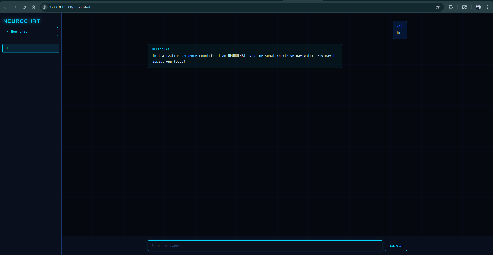

# NEUROCHAT 🤖

A futuristic AI chat application with a sci-fi aesthetic, built from scratch using vanilla HTML, CSS, and JavaScript.

## Features
- Real AI responses powered by Groq (LLaMA 3.1)
- Multiple chat sessions with sidebar
- Typing animation while AI thinks
- Sci-fi dark theme with glowing cyan accents
- Auto-resizing input, Enter to send
- Full conversation context memory

## Tech Stack
- HTML, CSS, JavaScript (no frameworks)
- Groq API (LLaMA 3.1 8B Instant)
- Google Fonts (Orbitron + Share Tech Mono)

## Setup
1. Clone the repo
2. Get a free API key from console.groq.com
3. Paste your key in `script.js` where it says `YOUR_GROQ_KEY_HERE`
4. Open with Live Server or `npx serve .`

## Screenshots

## Built by
Om — learning to build AI apps from scratch.
